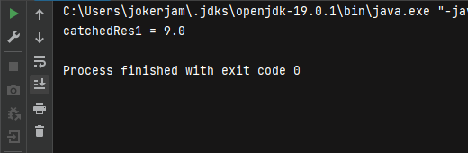
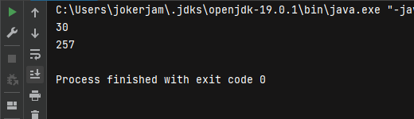
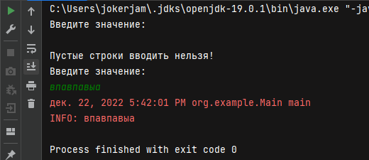

# Исключения в программировании и их обработка

## Исключения и их обработка

### Задача 1

Реализуйте метод, который запрашивает у пользователя ввод дробного числа (типа float), и возвращает введенное значение. Ввод текста вместо числа не должно приводить к падению приложения, вместо этого, необходимо повторно запросить у пользователя ввод данных.

Скрин

---

### Задача 2 

Если необходимо, исправьте данный код  
(задание 2 https://docs.google.com/document/d/17EaA1lDxzD5YigQ5OAal60fOFKVoCbEJqooB9XfhT7w/edit)

Скриншот

---

### Задача 3

Дан следующий код, исправьте его там, где требуется  
(задание 3 https://docs.google.com/document/d/17EaA1lDxzD5YigQ5OAal60fOFKVoCbEJqooB9XfhT7w/edit)

Скриншот

--- 

### Задача 4

Разработайте программу, которая выбросит Exception, когда пользователь вводит пустую строку. Пользователю должно показаться сообщение, что пустые строки вводить нельзя.

Скриншот

--- 

Задиния по ссылке:

Задание 2
try {
   int d = 0;
   double catchedRes1 = intArray[8] / d;
   System.out.println("catchedRes1 = " + catchedRes1);
} catch (ArithmeticException e) {
   System.out.println("Catching exception: " + e);
}

Задание 3

public static void main(String[] args) throws Exception {
   try {
       int a = 90;
       int b = 3;
       System.out.println(a / b);
       printSum(23, 234);
       int[] abc = { 1, 2 };
       abc[3] = 9;
   } catch (Throwable ex) {
       System.out.println("Что-то пошло не так...");
   } catch (NullPointerException ex) {
       System.out.println("Указатель не может указывать на null!");
   } catch (IndexOutOfBoundsException ex) {
       System.out.println("Массив выходит за пределы своего размера!");
   }
}
public static void printSum(Integer a, Integer b) throws FileNotFoundException {
   System.out.println(a + b);
}

